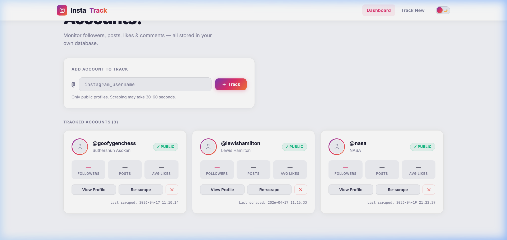
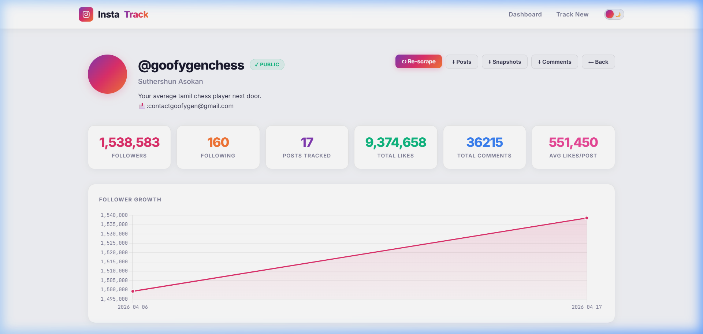
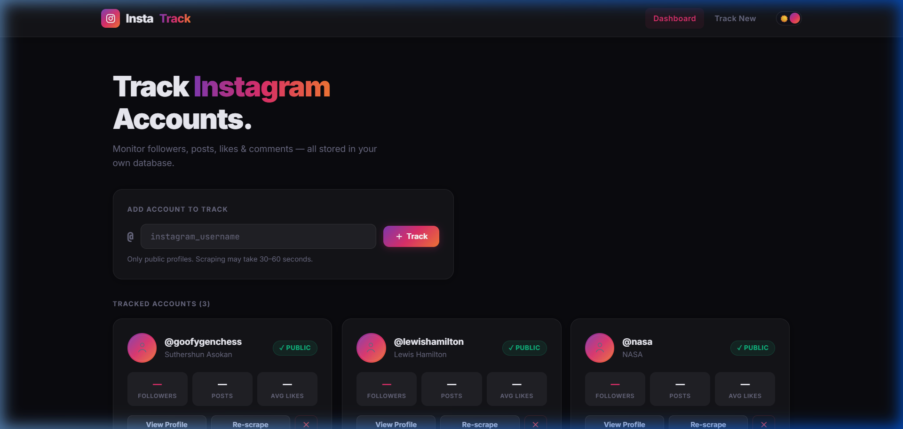
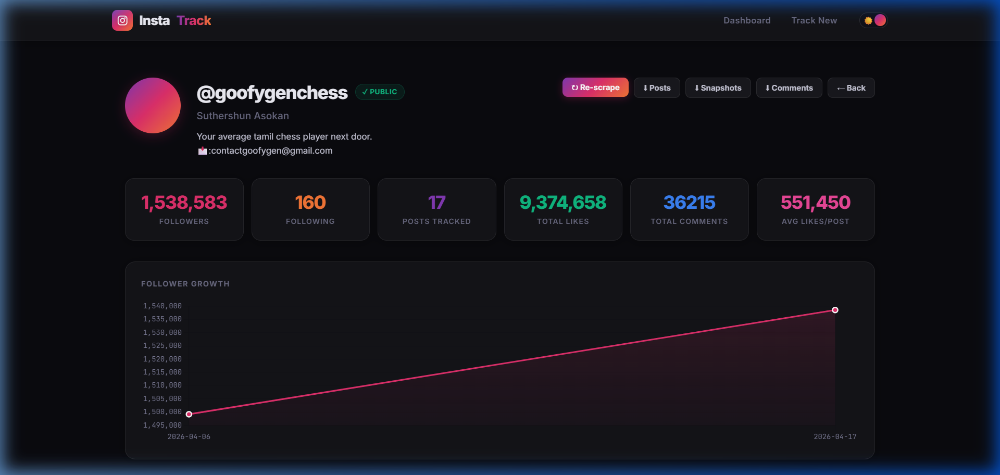

# 📊 InstaTrack

A self-hosted Instagram analytics tracker that monitors public profiles, tracks follower growth, collects post engagement data, and stores everything in your own MySQL database.


---

## ✨ Features

- **Track Multiple Accounts** — Add any public Instagram username and monitor it over time
- **Follower Growth Charts** — Visualize follower/following trends with interactive Chart.js graphs
- **Post Analytics** — Track likes, comments, and views for each post
- **Comment Collection** — Store and browse comments on tracked posts
- **Snapshot History** — See follower count changes (Δ) between each scrape
- **CSV Exports** — Download posts, snapshots, and comments as CSV files
- **Auto-Scraping** — Built-in scheduler to re-scrape all accounts automatically
- **Dark/Light Theme** — Toggle between themes with one click (preference saved locally)
- **Responsive Design** — Works on desktop, tablet, and mobile

---

## 🖼️ Screenshots

### Light Theme
| Dashboard | Profile Analytics |
|:---------:|:-----------------:|
|  |  |

### Dark Theme
| Dashboard | Profile Analytics |
|:---------:|:-----------------:|
|  |  |

---

## 🛠️ Tech Stack

| Component | Technology |
|-----------|-----------|
| **Backend** | Python, Flask |
| **Scraping** | [Instagrapi](https://github.com/subzeroid/instagrapi) (Instagram Private API) |
| **Database** | MySQL 8.x |
| **Frontend** | Jinja2 Templates, Vanilla CSS, Chart.js |
| **Scheduler** | APScheduler |

---

## 🚀 Getting Started

### Prerequisites

- **Python 3.8+**
- **MySQL 8.x** running locally (or remotely)
- An **Instagram account** (used for API authentication)

### 1. Clone the Repository

```bash
git clone https://github.com/YOUR_USERNAME/instagram_tracker.git
cd instagram_tracker
```

### 2. Install Dependencies

```bash
pip install flask instagrapi mysql-connector-python apscheduler
```

### 3. Configure

Copy the example config and fill in your credentials:

```bash
cp "config(example).py" config.py
```

Edit `config.py` with your details:

```python
DB_CONFIG = {
    "host":     "localhost",
    "port":     3306,
    "user":     "your_mysql_user",
    "password": "your_mysql_password",
    "database": "instagram_tracker"
}

INSTAGRAM_USERNAME = "your_instagram_username"
INSTAGRAM_PASSWORD = "your_instagram_password"
```

> ⚠️ **Tip:** Use a secondary/throwaway Instagram account, not your personal one.

### 4. Set Up the Database

```bash
python setup_db.py
```

This creates the `instagram_tracker` database and all required tables automatically.

### 5. Run the App

```bash
python app.py
```

Open **http://localhost:5000** in your browser.

### 6. (Optional) Enable Auto-Scraping

In a separate terminal:

```bash
python scheduler.py
```

This will re-scrape all tracked accounts every 6 hours (configurable in `config.py`).

---

## 📁 Project Structure

```
instagram_tracker/
├── app.py                  # Flask web server & routes
├── config.py               # Your credentials (gitignored)
├── config(example).py      # Example config template
├── tracker.py              # Scrape pipeline (fetch → save)
├── export.py               # CSV export helpers
├── scheduler.py            # Background auto-scraper
├── setup_db.py             # Database setup script
├── db/
│   ├── __init__.py
│   ├── queries.py          # All database queries
│   └── schema.sql          # MySQL table definitions
├── scrapers/
│   ├── __init__.py
│   └── instagram.py        # Instagrapi scraping logic
└── templates/
    ├── base.html            # Base layout + theme toggle
    ├── index.html           # Dashboard page
    ├── profile.html         # Profile analytics page
    └── post.html            # Post detail page
```

---

## 🔧 How It Works

1. **You enter a username** on the dashboard
2. **Instagrapi** logs into Instagram's API and fetches the profile, recent posts, and comments
3. **Data is saved** to your MySQL database (accounts, snapshots, posts, post_stats, comments)
4. **The dashboard** displays all tracked accounts with their latest stats
5. **Profile pages** show follower growth charts, post tables, and snapshot history
6. **The scheduler** (optional) repeats this process automatically for all tracked accounts

```
User → Flask → Instagrapi → Instagram API
                   ↓
              MySQL Database
                   ↓
         Dashboard / Charts / CSV Exports
```

---

## 📊 Database Schema

| Table | Purpose |
|-------|---------|
| `accounts` | Tracked Instagram profiles (username, bio, profile pic) |
| `snapshots` | Follower/following/post count over time |
| `posts` | Individual posts (shortcode, caption, type) |
| `post_stats` | Likes/comments/views per post (tracked over time) |
| `comments` | Individual comments on posts |
| `followers` | Follower list snapshots |

---

## ⚙️ Configuration Options

| Setting | Default | Description |
|---------|---------|-------------|
| `SCRAPE_DELAY_SECONDS` | `5` | Delay between API requests |
| `MAX_POSTS_PER_SCRAPE` | `12` | Posts to fetch per scrape |
| `MAX_COMMENTS_PER_POST` | `20` | Comments to collect per post |
| `AUTO_SCRAPE_INTERVAL_HOURS` | `6` | Auto-scrape frequency (0 = disabled) |
| `FLASK_PORT` | `5000` | Web server port |
| `FLASK_DEBUG` | `True` | Flask debug mode |

---

## ⚠️ Disclaimer

> **This project is for educational and personal use only.**
>
> This tool interacts with Instagram's private API through the [Instagrapi](https://github.com/subzeroid/instagrapi) library. Using automated tools to access Instagram may violate [Instagram's Terms of Service](https://help.instagram.com/581066165581870).
>
> The authors of this project are **not responsible** for:
> - Any misuse of this software
> - Any account bans or restrictions imposed by Instagram
> - Any legal consequences arising from the use of this tool
> - Any data collected through this tool
>
> **By using this software, you agree that:**
> - You will only scrape **publicly available** data
> - You will **not** use collected data for commercial purposes without consent
> - You will comply with all applicable laws and regulations in your jurisdiction
> - You accept full responsibility for how you use this tool
>
> Use responsibly. Be respectful of rate limits and other users' privacy.

---

## 📄 License

This project is licensed under the MIT License — see the [LICENSE](LICENSE) file for details.

---

<p align="center">
  Built with ❤️ using Python & Flask
</p>
